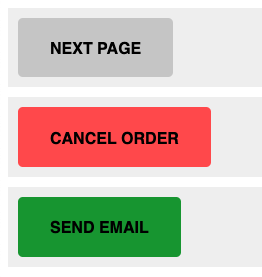

# BEM Navigation

This excersise demostrates using modifiers

## Part 1

Style the buttons in `index.html` to match the image.  The first button is using the default button styles.  Modify the others to alter the styling to match the image.

### Steps

1. The button class has been added to each element but the CSS styling for the it needs to be added to main.css.  You can copy the styles from the previous task for this.
2. BEM naming should be as generic as possible, to add re-use.  **Add** a modifier of "negative" for the red button, and "positive" for the green button.  Make sure both the standard "button" class, and the modifier class are both present in the class list.
3. in main.css, style the button class to make all the HTML elements appear as buttons.

## Part 2

Create a "back" button modifier and use the `::before` pseudo-selector, to create a back icon modifier.

### Steps

1. In the pseudo-selector, use the content property with the value of `"\0025C0"` (include the quotes) to output an arrow. ([details on using `::before` are here](https://css-tricks.com/almanac/selectors/a/after-and-before/))
1. Use the both the "back" modifer and the "negative" modifer on the last button to apply both styles.

# Answer

Once completed, checkout the `answer` branch to **compare your answer** to the working code.