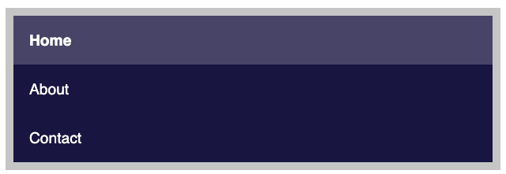

# BEM Navigation

This excersise demostrates using modifiers

## Part 1

Style the navigation in `index.html` to match the image.  

### Steps

1. The in `index.html `navigation block class ("nav") has already been set.  Complete the class naming on the rest of the elements.  Make sure every HTML element inside the "nav" block has a class name.
2. In `main.css`, style the navigation.

## Part 2

Use the block modifier to with BEM element selector.  This is the only time nested selectors are allowed when using BEM.

### Steps

1. In Part 2, the block selector ("nav") and block modifier ("nav--bar") have already been set. Complete the class naming on the rest of the elements.  Make sure every HTML element inside the "nav" block has a class name - **Note** it should be the same as part 1.
2. In `main.css`, Create a mested selector, using the block modifier, to make the navigation inline.
3. **Important:** Make sure this new styling doesn't change the navigation from part 1.

# Answer

Once completed, checkout the `answer` branch to **compare your answer** to the working code.